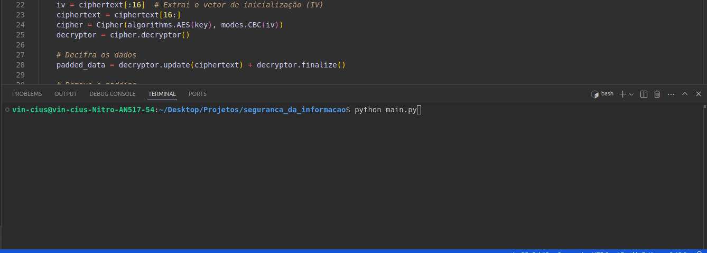

# Cifração Simétrica com AES

Este projeto implementa um algoritmo de **criptografia simétrica** utilizando o **AES (Advanced Encryption Standard)**. Ele cifra e decifra mensagens utilizando uma chave gerada aleatoriamente, empregando o modo de operação **CBC (Cipher Block Chaining)** e **padding PKCS7** para garantir que os dados estejam alinhados ao tamanho de bloco exigido pelo algoritmo AES.

## Descrição do Projeto

O programa permite ao usuário:
1. Inserir uma mensagem que será cifrada.
2. Utilizar uma chave de 256 bits (32 bytes) gerada automaticamente para cifrar a mensagem.
3. A mensagem cifrada é apresentada em formato **Base64**.
4. A mensagem cifrada é então decifrada de volta à sua forma original.

### Funcionalidades
- **Cifração e decifração de mensagens** com AES em modo CBC.
- **Geração automática de chave** de 256 bits para cada execução.
- **Padding PKCS7** utilizado para garantir que os dados se ajustem ao tamanho de bloco necessário.
- **Codificação/decodificação Base64** para a transmissão segura de dados cifrados.

## Como Usar

1. **Instalar a biblioteca de criptografia**:
   Para rodar este programa, você precisa da biblioteca `cryptography`. Para instalá-la, execute o seguinte comando:
   ```bash
   pip install cryptography
   
2. **Rodar o projeto**:
   Para rodar este programa, execute o seguinte comando:
   ```bash
   python main.py

## Demonstração

### 1. O Sistema Iniciando
Aqui você verá a execução inicial do sistema.:



### 2. Entrada da Mensagem
Após a execução, o programa solicita que o usuário insira a mensagem a ser criptografada.


### 3. Resultado Final
No final, você verá o **texto criptografado** e o **texto descriptografado**, como mostrado abaixo:


